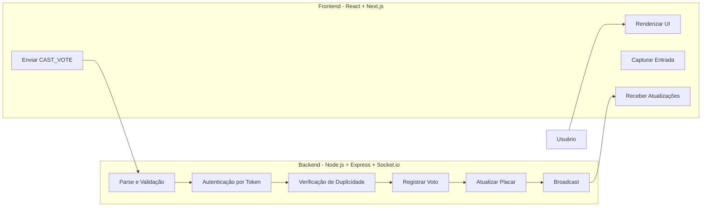
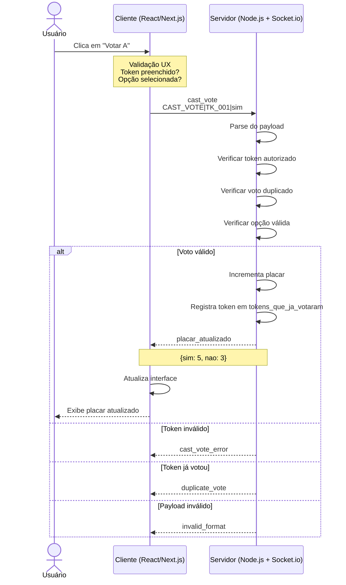

# CIN0143 - Digital Assembly Voting System

Sistema de votação digital distribuído para assembleias de condomínios ou corporativas, com suporte a múltiplos clientes simultâneos e sessões em tempo real.

##  Visão Geral

Este repositório contém a arquitetura, a documentação e o esqueleto base de um **Sistema de Votação Digital para Assembleias**, projetado para:

- Gerenciar sessões de votação em tempo real
- Suportar múltiplos clientes conectados concorrentemente
- Garantir integridade e unicidade dos votos por token

---
___Seção Entrega 2

**1. Instalar dependências**

```bash
git clone <repo>
cd cin0143-digital-assembly
npm install
```

**2. Iniciar o servidor (Terminal 1)**

```bash
npm run dev
```

Saída esperada:

```
[2026-06-18 19:06:32] [INFO] [SERVER] Servidor iniciado
  ├─ url: http://localhost:3001
  └─ websocket: ws://localhost:3001
[2026-06-18 19:06:32] [INFO] [SERVER] Sistema aguardando conexões...
  └─ sessao_padrao: assembleia-2026-06
```

**3. Abrir console de gerenciamento (Terminal 2)**

```bash
npm run console
```

Comandos disponíveis:

```
 
  LIST_TOKENS           - Listar todos os tokens válidos
  LIST_VOTES            - Listar votos registrados
  PLACAR                - Exibir placar atual
  CLEAR / HELP / EXIT
```

**Tokens de teste:**

Os tokens de teste não são pré-carregados ao iniciar o servidor. Eles são criados sob demanda, conforme solicitado pelo usuário:
1. Você inicia o servidor : npm run dev. Inicia o  console (painel gerencial : npm run console) e faz quantos clientes quiser com npm run client em diferentes terminais.

---

### Exemplos de Clientes via Terminal (3,4..5)]
Abrir outros terminais simulando o cliente

#### Teste 1: Voto válido (primeira votação)

Para testar no cliente, pegue o token gerado e vote 'vote TOKEN Sim".
Saída esperada no cliente:
```bash
Voto enviado: token=TK_CLIENT_4BCEFBB5D8354EAE8A60EE318400EFC6 | opcao=sim
cliente> Placar atualizado: { sim: 2, nao: 0 }
```
Logs gerados no servidor:
```bash

[2026-06-21 20:37:03] [SUCCESS] [VOTE_REGISTRATION] Voto registrado no placar
  ├─ token: TK_CLIEN***
  ├─ voto: sim
  ├─ total_sim: 2
  └─ total_nao: 0
[2026-06-21 20:37:03] [INFO] [VOTE_SUMMARY] Status da votação atualizado
  ├─ sessao_id: assembleia-2026-06
  ├─ votos_processados: 2
  ├─ sim: 2 votos (100.0%)
  ├─ nao: 0 votos (0.0%)
  ├─ tokens_aptos: 1
  ├─ tokens_votaram: 2
  └─ tokens_totais: 3
```

#### Teste 2: Voto duplicado rejeitado
Vote com um token 1 vez Na segunda , 
```bash
cliente> Erro de votação: {
  code: 'VOTO_DUPLICADO',
  message: 'Token já exerceu direito de voto.',
  severity: 'HIGH'
}
```

Logs gerados no servidor:

```
[2026-06-21 20:35:35] [ERROR] [VOTE_VALIDATION] Tentativa de voto duplicado rejeitada
  ├─ tipo_erro: VOTO_DUPLICADO
  ├─ token: TK_CLIEN***
  ├─ voto_anterior: sim
  ├─ voto_tentado: sim
  ├─ tentativa_reversao: NAO
  ├─ sessao_id: assembleia-2026-06
  ├─ ip_cliente: ::ffff:127.0.0.1
  ├─ timestamp_tentativa: 2026-06-21 20:35:35
  └─ timestamp_voto_anterior: 2026-06-21 20:35:33
[2026-06-21 20:35:35] [AUDITORIA] [AUDITORIA] Tentativa de voto duplicado detectada
  ├─ token_suspeito: TK_CLIEN***
  ├─ voto_anterior: sim
  ├─ voto_tentado: sim
  ├─ ip_origem: ::ffff:127.0.0.1
  └─ status: Monitorado
```

#### Teste 3: Token inválido

```bash
cliente> vote TK_CLIENT_0E0A6AC079DA459FA1988975EEF1CC Sim
Voto enviado: token=TK_CLIENT_0E0A6AC079DA459FA1988975EEF1CC | opcao=sim
cliente> Erro de votação: {
  code: 'TOKEN_NAO_AUTORIZADO',
  message: 'Você só pode votar usando o token gerado para esta conexão.',
  severity: 'HIGH'
}

Nos logs:
[2026-06-21 20:33:04] [ERROR] [VOTE_VALIDATION] Tentativa de votação com token não autorizado
  ├─ token: TK_CLIEN***
  ├─ sessao_id: assembleia-2026-06
  ├─ ip_cliente: ::ffff:127.0.0.1
  └─ acao_tomada: Voto rejeitado
[2026-06-21 20:33:04] [ALERT] [SEGURANCA] Possível tentativa de fraude detectada
  ├─ tipo: TOKEN_NAO_AUTORIZADO
  ├─ token_suspeito: TK_CLIEN***
  ├─ ip_origem: ::ffff:127.0.0.1
  └─ status: Flagged para investigação
```

---

### Interpretando os Logs

Os logs são gravados em **stdout** (exibidos nos respectivos terminais) e em arquivos em `apps/server/logs/`:

| Arquivo | Conteúdo |
|---|---|
| `app.log` | Todas as operações |
| `erros.log` | Erros e alertas de segurança |
| `auditoria.log` | Tentativas de fraude e duplicidade |

Formato:

```
[TIMESTAMP] [NIVEL] [MODULO] Mensagem
  ├─ campo: valor
  └─ campo: valor
```

Níveis: `INFO`, `SUCCESS`, `WARNING`, `ERROR`, `ALERT`, `AUDITORIA`

---

##  Stack & Justificativa Arquitetural

### Visão Full Stack

| Camada | Tecnologia | Papel |
|---|---|---|
| **Frontend** | React + Next.js | UI de votação e painel de monitoramento em tempo real |
| **Backend** | Node.js + Express.js | API HTTP, gerenciamento de sessões e roteamento |
| **WebSocket** | Socket.io | Canal de comunicação bidirecional em tempo real |
| **Linguagem** | TypeScript | Tipagem estática em todo o monorepo (front + back) |
| **Testes Unitários** | Jest | Validação de regras de domínio e lógica de negócio |
| **Testes de Carga** | K6 | Stress e concorrência de conexões WebSocket |

### Estrutura Monorepo

O projeto é organizado como um **monorepo**, separando claramente as responsabilidades

* A estrutura está descrita detalhadamente no final do README
-> A escolha pelo monorepo permite compartilhar tipos TypeScript entre frontend e backend, garantindo consistência nos contratos de mensagem.
  
## Arquitetura Cliente-Servidor

### Visão Geral

O sistema segue uma arquitetura **Cliente Servidor**:
- **Cliente**: Interface e validação UX 
- **Servidor**: Validação real, autorização, estado

### Diagrama de Arquitetura


## Por que Socket.io para o Sistema de Votação?

## Comunicação Orientada a Eventos e Bidirecional em Tempo Real

WebSockets, por meio do Socket.io, permitem comunicação **full-duplex** e **não bloqueante** entre clientes e servidor.

Para um sistema de votação, isso é essencial porque:

- Múltiplos clientes precisam receber atualizações instantaneamente conforme os votos são registrados.
- Sem atualização em tempo real, o placar pode ficar desincronizado.
- Alternativas baseadas em consultas repetidas (como ficar checando o sistema a todo momento) introduzem latência e aumentam o risco de inconsistências, incluindo vulnerabilidades relacionadas a votos duplicados.

## Baixo Acoplamento por Meio de Troca de Mensagens

O paradigma orientado a mensagens mantém os clientes desacoplados entre si.

Benefícios para o sistema de votação:

- O servidor propaga atualizações sem precisar conhecer detalhes da infraestrutura de cada cliente.
- Participantes pode se conectar simultaneamente.
- O placar permanece sincronizado globalmente.
- Novas regras de validação podem ser adicionadas futuramente sem alterar a comunicação entre clientes.

## Controle Centralizado da Sessão de Votação

O Socket.io mantém uma sessão persistente entre cliente e servidor, permitindo controle centralizado das conexões.

Isso possibilita:

- Identificação precisa do token associado a cada cliente conectado.
- Validação segura e singular dos tokens.
- Rastreamento confiável de quais participantes já votaram.
- Manutenção do servidor como única fonte de verdade do sistema.
- Eliminação de comandos simultâneos (race conditions) relacionadas ao processamento dos votos.

## Controle de Concorrência (`async-lock`)

O estado da votação (placar, tokens que já votaram, histórico de votos) fica **em memória** no servidor. Sem travas, múltiplos eleitores votando ao mesmo tempo poderiam corromper os totais ou permitir que o mesmo token passasse na validação duas vezes antes da gravação.

### Implementação

| Artefato | Caminho | Papel |
|---|---|---|
| Biblioteca | [`async-lock`](https://www.npmjs.com/package/async-lock) | Mutex assíncrono por chave |
| Serviço de trava | `apps/server/src/domain/lock.service.ts` | Instancia o lock e exporta `withSessionLock` |
| Integração | `apps/server/src/server.ts` | Envolve operações críticas com a trava |

O serviço centraliza o mutex por sessão:

```typescript
// apps/server/src/domain/lock.service.ts
return sessionLock.acquire(`session:${sessionId}`, task);
```

### Onde `withSessionLock` é aplicado

| Operação | Canal | Protegida |
|---|---|---|
| Registrar voto | `POST /api/sessions/:id/votes` | Sim |
| Registrar voto | WebSocket `cast_vote` | Sim |
| Reiniciar sessão | `POST /api/sessions/:id/reset` | Sim |

Dentro da trava, `processVote` executa de forma serializada por sessão: valida token → verifica duplicidade → incrementa placar → registra voto. Votos de tokens **diferentes** na mesma sessão são enfileirados; votos **duplicados** do mesmo token em paralelo resultam em **apenas um aceite** e os demais rejeitados com `VOTO_DUPLICADO`.

### Como comprovar

```bash
# Testes unitários de concorrência (Jest)
npm run test

# Stress test HTTP com K6 (servidor deve estar rodando em :3001)
k6 run tests/load/voting-stress.js
```

Os testes em `apps/server/src/domain/lock.test.ts` simulam dezenas de votos paralelos via `Promise.all` + `withSessionLock`. O script K6 dispara dezenas de requisições simultâneas e valida consistência do placar no `teardown`. Se o K6 reportar `http_req_failed` alto ou `ERRO thresholds...`, leia o aviso na seção [Testes de Carga & Concorrência com K6](#testes-de-carga--concorrência-com-k6) — respostas **400** de voto duplicado são esperadas nesse script.

---
 
## Por que WebSocket em vez de MQTT?

## MQTT é Assíncrono e Altamente Desacoplado
Embora essas características sejam vantajosas em diversos cenários de IoT e telemetria, elas representam desafios para sistemas de votação - tornam difícil garantir que um token não vota duas vezes em alta concorrência.

Problemas potenciais:
- Um cliente pode receber confirmação de publicação antes da conclusão efetiva do processamento do voto.
- Caso ocorra uma falha entre a confirmação do broker e a persistência da operação no servidor, o sistema pode entrar em estado inconsistente.
- Torna-se mais difícil garantir a regra de **um voto por token** 

Além disso, Socket.io oferece **broadcast nativo de baixíssima latência** para sincronizar o placar em tempo real para todos os clientes, enquanto MQTT exigiria roteamento através de um broker separado.

---
##  Protocolo de Comunicação e Especificação de Payloads
 
A comunicação entre o Cliente e o Servidor  (Express/Socket.io) é orientada a eventos (**Event Driven**) e estruturada sob os seguintes contratos de mensagem:
 
---
 
### 1. Evento: `cast_vote` - Client → Server
 
| Campo | Valor |
|---|---|
| **Descrição** | Disparado pelo cliente para submeter um voto na assembleia |
| **Tipo de Dado** | String de texto simples (Textual Pleno) |
| **Delimitador** | `\|` (Pipeline) |
| **Formato Estrito** | `CAST_VOTE\|<token>\|<opcao>` |
| **Exemplo de Payload** | `CAST_VOTE\|TK_AUTO_8E3F2B1D\|nao` |
 
---
 
### 2. Evento: `placar_atualizado` - Server → Broadcast (todos os clientes)
 
| Campo | Valor |
|---|---|
| **Descrição** | Disparado pelo servidor imediatamente após o registro bem-sucedido de um voto válido |
| **Tipo de Dado** | Objeto JSON |
| **Canal** | `placar_atualizado_${sessao_id}` |
 
**Exemplo de Payload:**
 
```json
{
  "sim": 4,
  "nao": 2
}
```
``




##  Modelagem de Estado em Memória

O servidor mantém as sessões ativas em memória volátil com o seguinte esquema:

```json
{
  "sessao_id": "string",
  "placar_atual": {
    "sim": "number",
    "nao": "number"
  },
  "tokens_autorizados": ["string"],
  "tokens_que_ja_votaram": ["string"],
  "votos_realizados": [
    {
      "token": "string",
      "voto": "sim | nao",
      "timestamp": "string",
      "sessao_id": "string",
      "ip": "string",
      "socket_id": "string"
    }
  ]
}
```
## Como Inicializar uma Sessão

POST /api/sessions
Content-Type: application/json

```json
{
  "session_id": "ASSEMBLY_CONDOMINIO_JUN_2026",
  "opcoes": [
    "sim",
    "nao"
  ],
  "tokens_autorizados": [
    "TK_001",
    "TK_002",
    "TK_003"
  ]
}
```

Response: 201
{ "session_id": "...", "status": "OPEN" }

---

| Campo | Descrição |
|---|---|
| `sessao_id` | Identificador único da assembleia em curso |
| `placar_atual` | Contador em tempo real mapeando opções para totais de votos |
| `tokens_autorizados` | Lista de controle de acesso com tokens autorizados a votar |
| `tokens_que_ja_votaram` | Ledger antifraude com tokens que já submeteram um voto |

---

## Regras de Domínio & Lógica de Validação

Ao receber um payload no listener `cast_vote`, o backend executa um funil de verificação sequencial:

```
Payload recebido
      │
      ▼
┌─────────────────────────────────────────┐
│  Format Check                           │
│  Conforma com CAST_VOTE|<token>|<opcao>?│
└──────────────────┬──────────────────────┘
                   │ 
                   ▼
┌─────────────────────────────────────────┐
│  Step 1 - Autenticação                  │
│  <token> existe em tokens_autorizados?  │
└──────────────────┬──────────────────────┘
                   │ 
                   ▼
┌─────────────────────────────────────────┐
│  Step 2 - Controle de Duplicatas        │
│  <token> já está em                     │
│  tokens_que_ja_votaram?                 │
└──────────────────┬──────────────────────┘
                   │ (não votou ainda)
                   ▼
┌─────────────────────────────────────────┐
│  Step 3 -  Registro                     │
│  Incrementa placar_atual[opcao]         │
│  Adiciona token a tokens_que_ja_votaram │
└──────────────────┬──────────────────────┘
                   │
                   ▼
┌─────────────────────────────────────────┐
│  Step 4 - Broadcast                     │
│  e placar_atualizado_sessao             │
└─────────────────────────────────────────┘
```

> Qualquer falha em uma etapa retorna uma mensagem de erro ao cliente e **interrompe** o pipeline.

## Eventos de Erro (Server → Client)

| Evento | Payload | Quando |
|--------|---------|--------|
| cast_vote_error | {"error": "unauthorized"} | Token não autorizado |
| cast_vote_error | {"error": "duplicate_vote"} | Token já votou |
| cast_vote_error | {"error": "invalid_format"} | Payload malformado |

---
---

##  Testes & Verificação


### Ferramentas

| Ferramenta | Camada | Finalidade |
|---|---|---|
| **Jest** | Unitário / Integração | Testar validadores e regras de domínio isoladamente |
| **K6** | Carga & Concorrência | Simular clientes WebSocket simultâneos |

---

### Testes Unitários com Jest

Os testes unitários cobrem as regras de domínio do pipeline de validação de forma isolada.

**Executar:**

```bash
npm run test:coverage
```

**Cenários planejados:**

| Cenário | Descrição | Resultado Esperado |
|---|---|---|
| **A - Happy Path** | Token válido vota em opção válida | Placar incrementado, token registrado, broadcast emitido |
| **B - Fraude (double vote)** | Token válido submete `CAST_VOTE` duas vezes | Erro retornado (Passo 2) |
| **C - Intrusão** | Token não listado tenta votar |Erro retornado (Passo 1) |
| **D - Payload malformado** | String fora do formato `CAST_VOTE\|<token>\|<opcao>` | Rejeitado no Format Check |


### Testes de Carga & Concorrência com K6

O K6 simula dezenas de clientes enviando votos **simultaneamente via HTTP** (`POST /api/sessions/:id/votes`). Esse endpoint usa a mesma trava `withSessionLock` do WebSocket, exercitando o mutex em condições de alta concorrência.

**Pré-requisitos:** servidor rodando (`npm run dev`) e [K6 instalado](https://k6.io/docs/get-started/installation/).

**Executar:**

```bash
npm run dev   # terminal 1 — porta 3001
k6 run tests/load/voting-stress.js
k6 run -e VUS=100 tests/load/voting-stress.js   # 100 votos paralelos
```

**Cenários do script (`tests/load/voting-stress.js`):**

| Cenário | O que testa |
|---|---|
| `votos_unicos` | N eleitores distintos votam em paralelo |
| `voto_duplicado` | N tentativas simultâneas com o **mesmo** token (só 1 aceita) |
| `teardown` | Placar final consistente (`sim + nao === total_votaram`) |

> **Aviso — `http_req_failed` e mensagem de ERRO no final**
>
> O cenário `voto_duplicado` envia várias requisições paralelas com o **mesmo** token de propósito. O servidor rejeita as repetições com **HTTP 400** (`VOTO_DUPLICADO`) — isso é o comportamento **esperado** e prova que a trava funciona.
>
> O K6, porém, trata **qualquer resposta fora de 2xx** como falha HTTP na métrica `http_req_failed`. Com 20 tentativas duplicadas, ~19 respostas 400 elevam essa taxa (ex.: ~28%) e podem disparar `ERRO thresholds on metrics 'http_req_failed' have been crossed` **sem indicar bug no servidor**.
>
> Para avaliar o teste, priorize:
> - `checks{scenario:votos_unicos}` e `checks{scenario:voto_duplicado}` em **100%**
> - check `placar = total_votaram` no teardown
> - check `aceito ou duplicado rejeitado` no cenário duplicado
>
> No Windows, se `k6` não for reconhecido no PATH, use o caminho completo: `& "C:\Program Files\k6\k6.exe" run tests/load/voting-stress.js`

**Metas do cenário de stress:**

| Parâmetro | Valor Alvo |
|---|---|
| Clientes simultâneos (VUs) | 50 (padrão), configurável via `-e VUS=100` |
| Janela de disparo | Mesma janela de milissegundos (`shared-iterations`) |
| Duração máxima | 60s |
| Checks dos cenários (`votos_unicos`, `voto_duplicado`) | > 99% |
| `http_req_failed` global | Pode ficar alto por causa dos **400 esperados** no cenário duplicado (ver aviso acima) |

**O que é monitorado:**

- Race conditions no acesso concorrente ao estado em memória
- Consistência do placar após múltiplos votos simultâneos
- Comportamento do servidor ao receber tokens duplicados em paralelo

---

##  Como Executar

### Pré-requisitos

- Node.js 18+
- npm

### Instalação

Clone o repositório e instale as dependências de todo o monorepo:

```bash
npm install
```

### Comandos principais

| Comando | Descrição |
|---|---|
| `npm run dev` | Inicia servidor Express + Socket.io (porta 3001) |
| `npm run client` | Cliente manual independente, gera token automático e permite votar via terminal |
| `npm run console` | Console interativo local de autenticação e votação, incluindo `SESSION` |
| `npm run vote:test` | Cliente WebSocket de teste (envia um CAST_VOTE) |
| `npm test` | Testes unitários Jest |
| `npm start` | Servidor compilado (requer `npm run build` antes) |

| Serviço | URL padrão |
|---|---|
| Backend (Express + Socket.io) | `http://localhost:3001` |
| Frontend (Next.js) | `http://localhost:3000` |

### Cliente manual independente

Para conectar um cliente novo em outro terminal, gerar um token próprio e votar manualmente, rode:

```bash
npm run client
```

O cliente abre uma sessão Socket.io com o servidor, recebe um token gerado automaticamente no mesmo padrão do console e passa a aceitar apenas comandos de votação no próprio terminal:

```text
vote sim     # envia voto para sim
vote nao     # envia voto para nao
exit         # encerra o cliente
```

Cada conexão, autorização de token e voto aceito/rejeitado fica registrada nos logs do servidor.

Para testar duplicidade, use o mesmo cliente e execute `vote A` duas vezes. A segunda tentativa deve ser rejeitada como voto duplicado.


##  Autenticação em Memória & Prevenção de Fraude 

### Estratégia de Autenticação por Token
 
Para o escopo atual da arquitetura, o sistema evita consultas externas de sessão. A identidade é verificada **evento a evento**:
 
- O identificador único do cliente (Token) é embutido diretamente na string do payload
- A cada clique no botão de votação, o cliente transmite o texto estrito: `CAST_VOTE|<token>|<opcao>`
- O servidor analisa e processa os dados em tempo real: ao receber o evento, abre o envelope, isola o <token> e executa imediatamente as regras de domínio.

---
 
### Registros em Memória
 
Para gerenciar o rastreamento sem infraestrutura de banco de dados, o backend Express/Socket.io mantém as seguintes estruturas em tempo de execução:
 
| Estrutura | Tipo | Inicialização | Papel |
|---|---|---|---|
| `tokens_autorizados` | `string[]` | Populado no servidor | Registro de controle de acesso - lista todos os tokens legalmente registrados na sessão (ex.: `['TK_USER1', 'TK_USER2', 'TK_USER3']`) |
| `tokens_que_ja_votaram` | `string[]` | Inicializado vazio `[]` | Registro antifraude — barreira contra votos duplos, atualizada a cada voto confirmado |
 
---
 
###  Lógica Backend

Esta seção detalha a implementação prática do pipeline de validação definido acima e na seção ### Regras de Domínio & Lógica de Validação.
Quando uma string de payload  chega pela interface de rede WebSocket, há as seguintes validações:
 
```text
Payload de Entrada: "CAST_VOTE|TK_USER1|sim"
              │
              ▼
   ┌────────────────────────────────┐
   │     Parsing da String          │ ──► Separa o payload pelo delimitador '|'
   └────────────────────────────────┘
              │
              ▼
   ┌────────────────────────────────┐
   │  Verificação de Autorização    │ ──► Inclui o token do usuário em tokens_autorizados.
   └────────────────────────────────┘     False: Rejeita com evento "Acesso Negado"
              │ True
              ▼
   ┌────────────────────────────────┐
   │  Bloqueio de Voto Duplo        │ ──► Inclui o token do usuário em tokens_que_ja_votaram
   └────────────────────────────────┘     Se já estiver lá: Rejeita com evento "Fraude Detectada" de duplicação. Caso contrário, vai para o último passo.
              │ False
              ▼
   ┌────────────────────────────────┐
   │  Registro (escrita)            │ ──► 1. Incrementa placar_atual['sim'] em +1
   └────────────────────────────────┘     2. Insere 'TK_USER1' em tokens_que_ja_votaram
              │
              ▼
   Broadcast disparado para todos os sockets (placar_atualizado)
```


### Testes

```bash
# Testes unitários (Jest — inclui concorrência em lock.test.ts)
npm run test

# Testes de carga (K6 — requer servidor em :3001)
npm run dev
k6 run tests/load/voting-stress.js
```

---

##  Estrutura de Diretórios

```
├── apps/
│   ├── web/                        # Frontend — Next.js + React
│   │   └── src/app/                # App Router (pages e layouts)
│   │
│   └── server/                     # Backend — Node.js + Express + Socket.io
│       ├── logs/                   # Logs operacionais (app, erros, auditoria)
│       └── src/
│           ├── console.ts          # Console interativo de testes (Entrega 2)
│           ├── domain/             # Parsers, validadores, lock.service.ts e regras de negócio
│           ├── handlers/           # Tratamento de votos e logging
│           ├── loggers/            # Sistema de logs estruturados
│           ├── repository/         # Estado efêmero em memória (sessões ativas)
│           └── server.ts           # Entry point — Express + Socket.io
│
├── script.ts                       # Cliente WebSocket de teste rápido
├── tests/
│   └── load/
│       └── voting-stress.js        # Script de carga K6
│
├── package.json                    # Workspaces do monorepo
└── README.md
```

---
