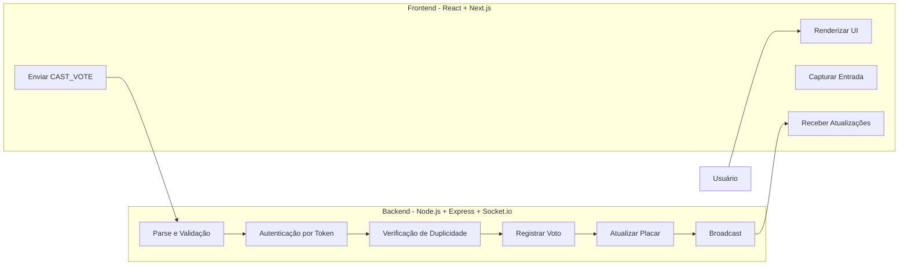
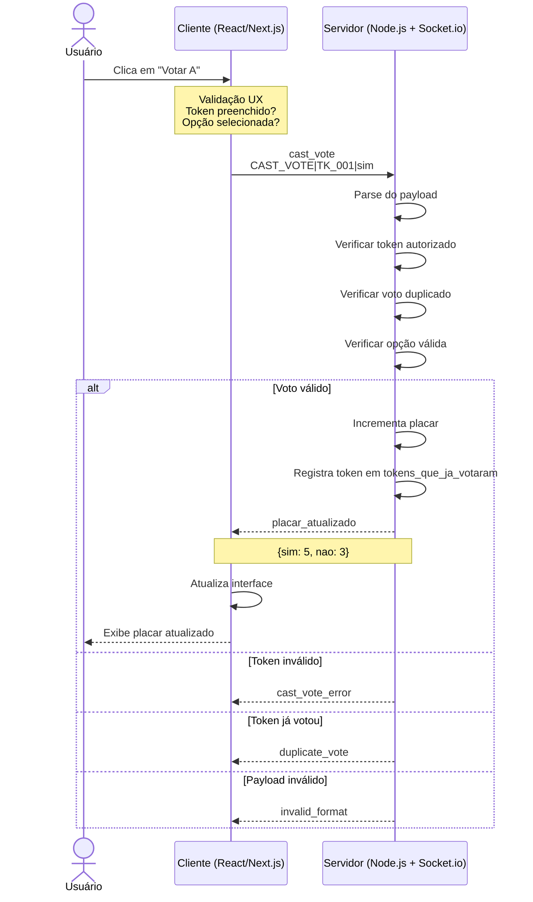

# CIN0143 - Digital Assembly Voting System

Sistema de votação digital distribuído para assembleias de condomínios ou corporativas, com suporte a múltiplos clientes simultâneos e sessões em tempo real.

##  Visão Geral

Este repositório contém a arquitetura, a documentação e o esqueleto base de um **Sistema de Votação Digital para Assembleias**, projetado para:

- Votação autenticada por token com validação no servidor
- Placar sincronizado em tempo real via WebSocket (Socket.io)
- Painel público de apuração com toasts de eventos ao vivo
- Console gerencial para inspeção de tokens, votos e sessão
- Travas atômicas (`async-lock`) para evitar race conditions em votos simultâneos
- Cronômetro de sessão sincronizado com o servidor (persiste entre recargas)


---
___Seção Entrega 2

**1. Instalar dependências**

```bash
git clone https://github.com/Beatriz-dos-Anjos/cin0143-digital-assembly
cd cin0143-digital-assembly
npm install
```

**2. Iniciar o servidor (Terminal 1)**

```bash
npm run dev
```

Saída esperada:

```
 Default session initialized
  ├─ session_id: assembleia-2026-06
  └─ total_tokens: 10
[2026-06-28 18:11:45] [SUCCESS] [SERVER] Server started successfully
  ├─ port: 3001
  ├─ url: http://localhost:3001
  ├─ websocket: ws://localhost:3001
  └─ environment: development
[2026-06-28 18:11:45] [INFO] [SERVER] System waiting for connections...
```


**Tokens de teste:**

Os tokens de teste são pré-carregados ao iniciar o servidor. Eles estão em uma lista estática de tokens autorizados para votar. Você pode utilizar qualquer um dos seguintes tokens para simular votações:

- `550e8400-e29b-41d4-a716-446655440000`
- `6ba7b810-9dad-11d1-80b4-00c04fd430c8`
- `6ba7b811-9dad-11d1-80b4-00c04fd430c8`
- `6ba7b812-9dad-11d1-80b4-00c04fd430c8`
- `6ba7b814-9dad-11d1-80b4-00c04fd430c8`
- `7c9e6679-7425-40de-944b-e07fc1f90ae7`
- `a987fbc9-4bed-3078-cf07-9141ba07c9f3`
- `b8659fc7-5b65-4c38-8a8b-bedd779e64e9`
- `d9428888-122b-11e1-b85c-61cd3cbb3210`
- `f47ac10b-58cc-4372-a567-0e02b2c3d479`

---

### Exemplos de Clientes via Terminal (3,4..5)]
Abrir outros terminais na RAIZ simulando o cliente. 

#### Teste 1: Voto válido (primeira votação)

Para testar no cliente, pegue o token gerado e vote 'vote TOKEN Sim".
Saída esperada no cliente:
```bash
Voto enviado: token=TK_CLIENT_4BCEFBB5D8354EAE8A60EE318400EFC6 | opcao=sim
cliente> Placar atualizado: { sim: 2, nao: 0 }
```
Logs gerados no servidor:
```bash

[2026-06-28 18:36:48] [SUCCESS] [VOTE_VALIDATION] Vote validated and registered successfully
  ├─ token: TK_CLIEN***
  ├─ vote: SIM
  ├─ session_id: assembleia-2026-06
  ├─ client_ip: ::ffff:127.0.0.1
  └─ timestamp: 2026-06-28 18:36:48
[2026-06-28 18:36:48] [SUCCESS] [VOTE_REGISTRATION] Vote registered in score
  ├─ token: TK_CLIEN***
  ├─ vote: SIM
  ├─ total_sim: 3
  └─ total_nao: 1
[2026-06-28 18:36:48] [INFO] [VOTE_SUMMARY] Voting status updated
  ├─ session_id: assembleia-2026-06
  ├─ processed_votes: 4
  ├─ sim: 3 votes (75.0%)
  ├─ no: 1 votes (25.0%)
  ├─ eligible_tokens: 7
  ├─ voted_tokens: 4
  └─ total_tokens: 11
```

#### Teste 2: Voto duplicado rejeitado
Vote com um token 1 vez Na segunda , 
```bash
cliente> Erro de votação: {
  code: 'VOTO_DUPLICADO',
  message: 'Token já exerceu direito de voto.',
  severity: 'HIGH'
}
```

Logs gerados no servidor:

```
[2026-06-28 18:38:07] [ERROR] [VOTE_VALIDATION] Duplicate vote attempt rejected
  ├─ error_type: DUPLICATE_VOTE
  ├─ token: TK_CLIEN***
  ├─ previous_vote: SIM
  ├─ attempted_vote: SIM
  ├─ reversion_attempt: nao
  ├─ session_id: assembleia-2026-06
  ├─ client_ip: ::ffff:127.0.0.1
  ├─ attempt_timestamp: 2026-06-28 18:38:07
  └─ previous_vote_timestamp: 2026-06-28 18:36:48
[2026-06-28 18:38:07] [AUDIT] [AUDIT] Duplicate vote attempt detected
  ├─ suspicious_token: TK_CLIEN***
  ├─ previous_vote: SIM
  ├─ attempted_vote: SIM
  ├─ source_ip: ::ffff:127.0.0.1
  └─ status: Monitored

```

#### Teste 3: Token inválido

```bash
cliente> vote TK_CLIENT_0E0A6AC079DA459FA1988975EEF1CC Sim
Voto enviado: token=TK_CLIENT_0E0A6AC079DA459FA1988975EEF1CC | opcao=sim
cliente> Erro de votação: {
  code: 'TOKEN_NAO_AUTORIZADO',
  message: 'Você só pode votar usando o token gerado para esta conexão.',
  severity: 'HIGH'}

Nos logs:
[2026-06-28 18:38:42] [ERROR] [VOTE_VALIDATION] Voting attempt with unauthorized token rejected
  ├─ error_type: UNAUTHORIZED_TOKEN
  ├─ token: TK_CLIEN***
  ├─ session_id: assembleia-2026-06
  ├─ client_ip: ::ffff:127.0.0.1
  └─ action_taken: Vote rejected
[2026-06-28 18:38:42] [AUDIT] [AUDIT] Voting attempt with unauthorized token detected
  ├─ type: UNAUTHORIZED_TOKEN
  ├─ suspicious_token: TK_CLIEN***
  ├─ source_ip: ::ffff:127.0.0.1
  └─ status: Monitored

```

---

### Interpretando os Logs

Os logs são gravados em **stdout** (exibidos nos respectivos terminais) e em arquivos em `apps/server/logs/`:

| Arquivo | Conteúdo |
|---|---|
| `app.log` | Todas as operações |
| `erros.log` | Erros e alertas de segurança |
| `auditoria.log` | Tentativas de fraude e duplicidade |

Formato:
f
```
[TIMESTAMP] [NIVEL] [MODULO] Mensagem
  ├─ campo: valor
  └─ campo: valor
```

Níveis: `INFO`, `SUCCESS`, `WARNING`, `ERROR`, `ALERT`, `AUDIT`

---

##  Stack & Justificativa Arquitetural

### Visão Full Stack

| Camada | Tecnologia | Papel |
|---|---|---|
| **Frontend** | React + Next.js | UI de votação e painel de monitoramento em tempo real |
| **Backend** | Node.js + Express.js | API HTTP, gerenciamento de sessões e roteamento |
| **WebSocket** | Socket.io | Canal de comunicação bidirecional em tempo real |
| **Linguagem** | TypeScript | Tipagem estática em todo o monorepo (front + back) |
| **Testes Unitários** | Jest | Validação de regras de domínio e lógica de negócio |
| **Testes de Carga** | K6 | Stress e concorrência de conexões WebSocket |

### Estrutura Monorepo

O projeto é organizado como um **monorepo**, separando claramente as responsabilidades

* A estrutura está descrita detalhadamente no final do README
-> A escolha pelo monorepo permite compartilhar tipos TypeScript entre frontend e backend, garantindo consistência nos contratos de mensagem.
  
## Arquitetura Cliente-Servidor

### Visão Geral

O sistema segue uma arquitetura **Cliente Servidor**:
- **Cliente**: Interface e validação UX 
- **Servidor**: Validação real, autorização, estado

### Diagrama de Arquitetura


## Por que Socket.io para o Sistema de Votação?

## Comunicação Orientada a Eventos e Bidirecional em Tempo Real

WebSockets, por meio do Socket.io, permitem comunicação **full-duplex** e **não bloqueante** entre clientes e servidor.

Para um sistema de votação, isso é essencial porque:

- Múltiplos clientes precisam receber atualizações instantaneamente conforme os votos são registrados.
- Sem atualização em tempo real, o placar pode ficar desincronizado.
- Alternativas baseadas em consultas repetidas (como ficar checando o sistema a todo momento) introduzem latência e aumentam o risco de inconsistências, incluindo vulnerabilidades relacionadas a votos duplicados.

## Baixo Acoplamento por Meio de Troca de Mensagens

O paradigma orientado a mensagens mantém os clientes desacoplados entre si.

Benefícios para o sistema de votação:

- O servidor propaga atualizações sem precisar conhecer detalhes da infraestrutura de cada cliente.
- Participantes pode se conectar simultaneamente.
- O placar permanece sincronizado globalmente.
- Novas regras de validação podem ser adicionadas futuramente sem alterar a comunicação entre clientes.

## Controle Centralizado da Sessão de Votação

O Socket.io mantém uma sessão persistente entre cliente e servidor, permitindo controle centralizado das conexões.

Isso possibilita:

- Identificação precisa do token associado a cada cliente conectado.
- Validação segura e singular dos tokens.
- Rastreamento confiável de quais participantes já votaram.
- Manutenção do servidor como única fonte de verdade do sistema.
- Eliminação de comandos simultâneos (race conditions) relacionadas ao processamento dos votos.

## Controle de Concorrência (`async-lock`)

O estado da votação (placar, tokens que já votaram, histórico de votos) fica **em memória** no servidor. Sem travas, múltiplos eleitores votando ao mesmo tempo poderiam corromper os totais ou permitir que o mesmo token passasse na validação duas vezes antes da gravação.

### Implementação

| Artefato | Caminho | Papel |
|---|---|---|
| Biblioteca | [`async-lock`](https://www.npmjs.com/package/async-lock) | Mutex assíncrono por chave |
| Serviço de trava | `apps/server/src/domain/lock.service.ts` | Instancia o lock e exporta `withSessionLock` |
| Integração | `apps/server/src/server.ts` | Envolve operações críticas com a trava |

O serviço centraliza o mutex por sessão:

```typescript
// apps/server/src/domain/lock.service.ts
return sessionLock.acquire(`session:${sessionId}`, task);
```

### Onde `withSessionLock` é aplicado

| Operação | Canal | Protegida |
|---|---|---|
| Registrar voto | `POST /api/sessions/:id/votes` | Sim |
| Registrar voto | WebSocket `cast_vote` | Sim |
| Reiniciar sessão | `POST /api/sessions/:id/reset` | Sim |

Dentro da trava, `processVote` executa de forma serializada por sessão: valida token → verifica duplicidade → incrementa placar → registra voto. Votos de tokens **diferentes** na mesma sessão são enfileirados; votos **duplicados** do mesmo token em paralelo resultam em **apenas um aceite** e os demais rejeitados com `VOTO_DUPLICADO`.

### Como comprovar

```bash
npm run test

k6 run tests/load/voting-stress.js
```

Os testes em `apps/server/src/domain/lock.test.ts` simulam dezenas de votos paralelos via `Promise.all` + `withSessionLock`. O script K6 dispara dezenas de requisições simultâneas e valida consistência do placar no `teardown`. Se o K6 reportar `http_req_failed` alto ou `ERRO thresholds...`, leia o aviso na seção [Testes de Carga & Concorrência com K6](#testes-de-carga--concorrência-com-k6) — respostas **400** de voto duplicado são esperadas nesse script.

---
 
## Por que WebSocket em vez de MQTT?

## MQTT é Assíncrono e Altamente Desacoplado
Embora essas características sejam vantajosas em diversos cenários de IoT e telemetria, elas representam desafios para sistemas de votação - tornam difícil garantir que um token não vota duas vezes em alta concorrência.

Problemas potenciais:
- Um cliente pode receber confirmação de publicação antes da conclusão efetiva do processamento do voto.
- Caso ocorra uma falha entre a confirmação do broker e a persistência da operação no servidor, o sistema pode entrar em estado inconsistente.
- Torna-se mais difícil garantir a regra de **um voto por token** 

Além disso, Socket.io oferece **broadcast nativo de baixíssima latência** para sincronizar o placar em tempo real para todos os clientes, enquanto MQTT exigiria roteamento através de um broker separado.

---
##  Protocolo de Comunicação e Especificação de Payloads
 
A comunicação entre o Cliente e o Servidor  (Express/Socket.io) é orientada a eventos (**Event Driven**) e estruturada sob os seguintes contratos de mensagem:
 
---
 
### 1. Evento: `cast_vote` - Client → Server
 
| Campo | Valor |
|---|---|
| **Descrição** | Disparado pelo cliente para submeter um voto na assembleia |
| **Tipo de Dado** | String de texto simples (Textual Pleno) |
| **Delimitador** | `\|` (Pipeline) |
| **Formato Estrito** | `CAST_VOTE\|<token>\|<opcao>` |
| **Exemplo de Payload** | `CAST_VOTE\|TK_AUTO_8E3F2B1D\|nao` |
 
---
 
### 2. Evento: `placar_atualizado` - Server → Broadcast (todos os clientes)
 
| Campo | Valor |
|---|---|
| **Descrição** | Disparado pelo servidor imediatamente após o registro bem-sucedido de um voto válido |
| **Tipo de Dado** | Objeto JSON |
| **Canal** | `placar_atualizado_${sessao_id}` |
 
**Exemplo de Payload:**
 
```json
{
  "sim": 4,
  "nao": 2
}
```
``




##  Modelagem de Estado em Memória

O servidor mantém as sessões ativas em memória volátil com o seguinte esquema:

```json
{
  "session_id": "assembleia-2026-06",
  "current_score": {
    "sim": 3,
    "nao": 1
  },
  "authorized_tokens": [
    "6ba7b811-9dad-11d1-80b4-00c04fd430c8",
    "6ba7b814-9dad-11d1-80b4-00c04fd430c8",
    "7c9e6679-7425-40de-944b-e07fc1f90ae7",
    "a987fbc9-4bed-3078-cf07-9141ba07c9f3",
    "b8659fc7-5b65-4c38-8a8b-bedd779e64e9",
    "d9428888-122b-11e1-b85c-61cd3cbb3210",
    "f47ac10b-58cc-4372-a567-0e02b2c3d479"
  ],
  "voted_tokens": [
    "550e8400-e29b-41d4-a716-446655440000",
    "6ba7b810-9dad-11d1-80b4-00c04fd430c8",
    "6ba7b812-9dad-11d1-80b4-00c04fd430c8",
    "TK_CLIENT_3BD45ECEB2DE4B88A069224A88B7A7D1"
  ],
  "started_at": 1782681671563,
  "duration_seconds": 180
}
```
## Como Inicializar uma Sessão

POST /api/sessions
Content-Type: application/json

Body: 
```json
{
  {
  "session_id": "ASSEMBLY_CONDOMINIO_JUN_2026",

  "authorized_tokens": [
    "TK_001",
    "TK_002",
    "TK_003"
  ]
}

}
```

Resposta:

```json
{
  "session_id": "ASSEMBLY_CONDOMINIO_JUN_2026",
  "status": "OPEN",
  "message": "Session created successfully"
}
```

Response: 201
{ "session_id": "...", "status": "OPEN" }


## Regras de Domínio & Lógica de Validação

Ao receber um payload no listener `cast_vote`, o backend executa um funil de verificação sequencial:

```
Payload recebido
      │
      ▼
┌─────────────────────────────────────────┐
│  Format Check                           │
│  Conforma com CAST_VOTE|<token>|<opcao>?│
└──────────────────┬──────────────────────┘
                   │ 
                   ▼
┌─────────────────────────────────────────┐
│  Step 1 - Autenticação                  │
│  <token> existe em tokens_autorizados?  │
└──────────────────┬──────────────────────┘
                   │ 
                   ▼
┌─────────────────────────────────────────┐
│  Step 2 - Controle de Duplicatas        │
│  <token> já está em                     │
│  tokens_que_ja_votaram?                 │
└──────────────────┬──────────────────────┘
                   │ (não votou ainda)
                   ▼
┌─────────────────────────────────────────┐
│  Step 3 -  Registro                     │
│  Incrementa placar_atual[opcao]         │
│  Adiciona token a tokens_que_ja_votaram │
└──────────────────┬──────────────────────┘
                   │
                   ▼
┌─────────────────────────────────────────┐
│  Step 4 - Broadcast                     │
│  e placar_atualizado_sessao             │
└─────────────────────────────────────────┘
```

> Qualquer falha em uma etapa retorna uma mensagem de erro ao cliente e **interrompe** o pipeline.

## Eventos de Erro (Server → Client)

| Evento | Payload | Quando |
|--------|---------|--------|
| cast_vote_error | {"error": "unauthorized"} | Token não autorizado |
| cast_vote_error | {"error": "duplicate_vote"} | Token já votou |
| cast_vote_error | {"error": "invalid_format"} | Payload malformado |

---
---

##  Testes & Verificação


### Ferramentas

| Ferramenta | Camada | Finalidade |
|---|---|---|
| **Jest** | Unitário / Integração | Testar validadores e regras de domínio isoladamente |
| **K6** | Carga & Concorrência | Simular clientes WebSocket simultâneos |

---

### Testes Unitários com Jest

Os testes unitários cobrem as regras de domínio do pipeline de validação de forma isolada.

**Executar:**

```bash
npm run test:coverage
```

**Cenários planejados:**

| Cenário | Descrição | Resultado Esperado |
|---|---|---|
| **A - Happy Path** | Token válido vota em opção válida | Placar incrementado, token registrado, broadcast emitido |
| **B - Fraude (double vote)** | Token válido submete `CAST_VOTE` duas vezes | Erro retornado (Passo 2) |
| **C - Intrusão** | Token não listado tenta votar |Erro retornado (Passo 1) |
| **D - Payload malformado** | String fora do formato `CAST_VOTE\|<token>\|<opcao>` | Rejeitado no Format Check |


### Testes de Carga & Concorrência com K6

O K6 simula dezenas de clientes enviando votos **simultaneamente via HTTP** (`POST /api/sessions/:id/votes`). Esse endpoint usa a mesma trava `withSessionLock` do WebSocket, exercitando o mutex em condições de alta concorrência.

**Pré-requisitos:** servidor rodando (`npm run dev`) e [K6 instalado](https://k6.io/docs/get-started/installation/).

**Executar:**

```bash
npm run dev   
k6 run tests/load/voting-stress.js
k6 run -e VUS=100 tests/load/voting-stress.js   # 100 votos paralelos
```

**Cenários do script (`tests/load/voting-stress.js`):**

| Cenário | O que testa |
|---|---|
| `votos_unicos` | N eleitores distintos votam em paralelo |
| `voto_duplicado` | N tentativas simultâneas com o **mesmo** token (só 1 aceita) |
| `teardown` | Placar final consistente (`sim + nao === total_votaram`) |

> **Aviso — `http_req_failed` e mensagem de ERRO no final**
>
> O cenário `voto_duplicado` envia várias requisições paralelas com o **mesmo** token de propósito. O servidor rejeita as repetições com **HTTP 400** (`VOTO_DUPLICADO`) — isso é o comportamento **esperado** e prova que a trava funciona.
>
> O K6, porém, trata **qualquer resposta fora de 2xx** como falha HTTP na métrica `http_req_failed`. Com 20 tentativas duplicadas, ~19 respostas 400 elevam essa taxa (ex.: ~28%) e podem disparar `ERRO thresholds on metrics 'http_req_failed' have been crossed` **sem indicar bug no servidor**.
>
> Para avaliar o teste, priorize:
> - `checks{scenario:votos_unicos}` e `checks{scenario:voto_duplicado}` em **100%**
> - check `placar = total_votaram` no teardown
> - check `aceito ou duplicado rejeitado` no cenário duplicado
>
> No Windows, se `k6` não for reconhecido no PATH, use o caminho completo: `& "C:\Program Files\k6\k6.exe" run tests/load/voting-stress.js`

**Metas do cenário de stress:**

| Parâmetro | Valor Alvo |
|---|---|
| Clientes simultâneos (VUs) | 50 (padrão), configurável via `-e VUS=100` |
| Janela de disparo | Mesma janela de milissegundos (`shared-iterations`) |
| Duração máxima | 60s |
| Checks dos cenários (`votos_unicos`, `voto_duplicado`) | > 99% |
| `http_req_failed` global | Pode ficar alto por causa dos **400 esperados** no cenário duplicado (ver aviso acima) |

**O que é monitorado:**

- Race conditions no acesso concorrente ao estado em memória
- Consistência do placar após múltiplos votos simultâneos
- Comportamento do servidor ao receber tokens duplicados em paralelo

---

##  Como Executar

O projeto é estruturado como um monorepo. Você pode iniciar os serviços tanto a partir da raiz quanto entrando em cada diretório específico.

### 1. Pré-requisitos
- Node.js 18+
- npm
- Lib async-lock (ver guia no readme)
- Lib toastify por npm

### 2. Instalação
A partir do diretório raiz:
```bash
npm install
```

### 3. Executando os Serviços em Desenvolvimento

Você precisará de pelo menos dois terminais abertos (um para o backend e outro para o frontend):

* **Servidor Backend (Porta 3001)**
  * A partir da raiz: `npm run dev:server` (ou `npm run dev`)
  * Ou acessando a pasta:
    ```bash
    cd apps/server
    npm run dev
    ```

* **Frontend Web (Porta 3000)**
  * A partir da raiz: `npm run dev:web`
  * Ou acessando a pasta:
    ```bash
    cd apps/web
    npm run dev
    ```

### 4. Outros Comandos Importantes

| Comando (Executado da Raiz) | Descrição |
|---|---|
| `npm run client` | Cliente interativo de terminal para testar votações |
| `npm run test` | Executa todos os testes unitários com Jest |
| `npm run vote:test` | Cliente de teste rápido para submeter um voto via WebSocket |

---

##  Interfaces Disponíveis 

Com o frontend (`apps/web`) e o backend (`apps/server`) em execução, você pode acessar as seguintes interfaces no navegador:

* **Página Inicial (`http://localhost:3000/`)**:
  Portal de entrada da Assembleia Digital que conecta para todas as interfaces disponíveis do sistema.

* **Cabine de Votação (`http://localhost:3000/voting-booth`)**:
  Interface onde os eleitores inserem seus tokens privados, escolhem seu voto (`SIM` ou `NÃO`) e realizam a submissão de forma segura.

* **Painel de Resultados (`http://localhost:3000/painel`)**:
  Painel público e dinâmico que exibe a apuração de votos em tempo real, atualizado instantaneamente via WebSocket conforme novos votos válidos são processados.

* **Comandos Gerenciais (`http://localhost:3000/commands`)**:
  Painel administrativo para monitorar a sessão, permitindo visualizar os tokens autorizados remanescentes, os votos registrados (tokens que já votaram e data/hora do voto) e o placar atual.

---

##  Guia de Testes Práticos (Interface Web)

Após iniciar o **servidor backend** (`localhost:3001`) e o **frontend web** (`localhost:3000`), você pode simular a assembleia diretamente pelo navegador.

###  Múltiplos Eleitores Simultâneos
Para simular vários eleitores votando em tempo real:
1. Abra **múltiplas abas ou janelas anônimas** do seu navegador acessando a Cabine de Votação:
   `http://localhost:3000/voting-booth`
2. Em cada aba, escolha ou digite um **Token Estático**, podendo fazer parte da lista de tokens estáticos.
3. Escolha uma opção (`SIM` ou `NÃO`) e submeta o voto. Ele será registrado e validado instantaneamente.

### Painel de Resultados 
Para acompanhar a apuração em tempo real:
1. Abra uma aba separada no link:
   `http://localhost:3000/painel`
2. Conforme os votos são enviados nas outras abas da *Cabine de Votação*, o painel será atualizado automaticamente, exibindo o placar e as porcentagens em tempo real com alertas visuais.

###  Simulação de Fraude (Voto Duplicado)
Você pode comprovar os mecanismos de prevenção a fraudes (Mutex com `async-lock` e validação antifraude):
1. Em qualquer aba da **Cabine de Votação** (`http://localhost:3000/voting-booth`), insira um token que **já tenha sido utilizado** para votar.
2. Tente votar novamente.
3. O sistema recusará o voto e exibirá uma notificação/alerta de confirmado ou rejeitado com a respectiva mensagem de erro de duplicidade.
4. No terminal do servidor (`apps/server`), você verá os logs de auditoria registrando a tentativa de duplicidade com detalhes como IP do cliente e data/hora do voto anterior. Também pode ser visto na pasta apps/server/logs.

---

###  Cliente manual independente (Terminal)

Para conectar um cliente novo em outro terminal, gerar um token próprio e votar manualmente, rode:

```bash
npm run client
```

O cliente abre uma sessão Socket.io com o servidor, recebe um token gerado automaticamente no mesmo padrão do console e passa a aceitar apenas comandos de votação no próprio terminal:

```text
vote <token> SIM    # envia voto para sim
vote <token> nao    # envia voto para nao
exit         # encerra o cliente
```

Cada conexão, autorização de token e voto aceito/rejeitado fica registrada nos logs do servidor.

Para testar duplicidade, use o mesmo cliente e execute `vote SIM` duas vezes. A segunda tentativa deve ser rejeitada como voto duplicado.


##  Autenticação em Memória & Prevenção de Fraude 

### Estratégia de Autenticação por Token
 
Para o escopo atual da arquitetura, o sistema evita consultas externas de sessão. A identidade é verificada **evento a evento**:
 
- O identificador único do cliente (Token) é embutido diretamente na string do payload
- A cada clique no botão de votação, o cliente transmite o texto estrito: `CAST_VOTE|<token>|<opcao>`
- O servidor analisa e processa os dados em tempo real: ao receber o evento, abre o envelope, isola o <token> e executa imediatamente as regras de domínio.

---
 
### Registros em Memória
 
Para gerenciar o rastreamento sem infraestrutura de banco de dados, o backend Express/Socket.io mantém as seguintes estruturas em tempo de execução:
 
| Estrutura | Tipo | Inicialização | Papel |
|---|---|---|---|
| `tokens_autorizados` | `string[]` | Populado no servidor | Registro de controle de acesso - lista todos os tokens legalmente registrados na sessão (ex.: `['TK_USER1', 'TK_USER2', 'TK_USER3']`) |
| `tokens_que_ja_votaram` | `string[]` | Inicializado vazio `[]` | Registro antifraude — barreira contra votos duplos, atualizada a cada voto confirmado |
 
---
 
###  Lógica Backend

Esta seção detalha a implementação prática do pipeline de validação definido acima e na seção ### Regras de Domínio & Lógica de Validação.
Quando uma string de payload  chega pela interface de rede WebSocket, há as seguintes validações:
 
```text
Payload de Entrada: "CAST_VOTE|TK_USER1|sim"
              │
              ▼
   ┌────────────────────────────────┐
   │     Parsing da String          │ ──► Separa o payload pelo delimitador '|'
   └────────────────────────────────┘
              │
              ▼
   ┌────────────────────────────────┐
   │  Verificação de Autorização    │ ──► Inclui o token do usuário em tokens_autorizados.
   └────────────────────────────────┘     False: Rejeita com evento "Acesso Negado"
              │ True
              ▼
   ┌────────────────────────────────┐
   │  Bloqueio de Voto Duplo        │ ──► Inclui o token do usuário em tokens_que_ja_votaram
   └────────────────────────────────┘     Se já estiver lá: Rejeita com evento "Fraude Detectada" de duplicação. Caso contrário, vai para o último passo.
              │ False
              ▼
   ┌────────────────────────────────┐
   │  Registro (escrita)            │ ──► 1. Incrementa placar_atual['sim'] em +1
   └────────────────────────────────┘     2. Insere 'TK_USER1' em tokens_que_ja_votaram
              │
              ▼
   Broadcast disparado para todos os sockets (placar_atualizado)
```


### Testes

```bash
# Testes unitários (Jest — inclui concorrência em lock.test.ts)
npm run test

# Testes de carga (K6 — requer servidor em :3001)
npm run dev
k6 run tests/load/voting-stress.js
```

---

## Estrutura de Diretórios

```
├── apps/
│   ├── web/                        # Frontend — Next.js + React
│   │   └── src/
│   │       ├── app/                # Next.js App Router (páginas /voting-booth, /painel, /commands)
│   │       ├── components/         # Componentes React de UI (Cabine, Painel de Resultados)
│   │       ├── hooks/              # Hooks customizados (useVoter, useAssembly, useTimer)
│   │       └── lib/                # APIs, sockets e lógica compartilhada do cliente
│   │
│   └── server/                     # Backend — Node.js + Express + Socket.io
│       ├── logs/                   # Logs operacionais (app, erros, auditoria)
│       └── src/
│           ├── domain/             # Modelos, validadores, locks do domínio e regras de negócio
│           ├── handlers/           # Handlers e formatadores de logging para socket/API
│           ├── loggers/            # Utilitários de logs estruturados em console/arquivos
│           ├── repository/         # Repositório de estado em memória (sessões ativas)
│           ├── routes/             # Rotas Express HTTP (API)
│           ├── sockets/            # Configuração e listeners do Socket.io
│           ├── token/              # Serviço de geração e validação de tokens
│           └── server.ts           # Ponto de entrada do backend
│
├── client.ts                       # Console interativo de terminal para testar votações
├── script.ts                       # Script de teste rápido do cliente WebSocket
├── tests/
│   └── load/
│       └── voting-stress.js        # Script de teste de carga concorrente via K6
│
├── package.json                    # Definições de workspaces do npm e scripts do monorepo
└── README.md
```

---
