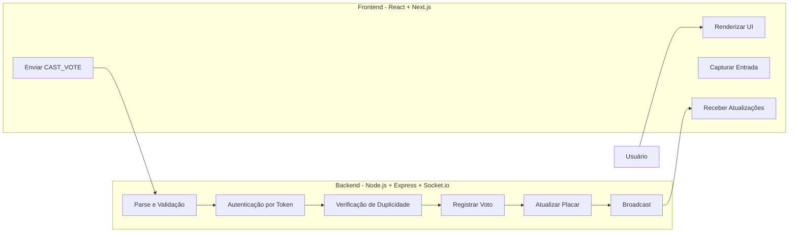
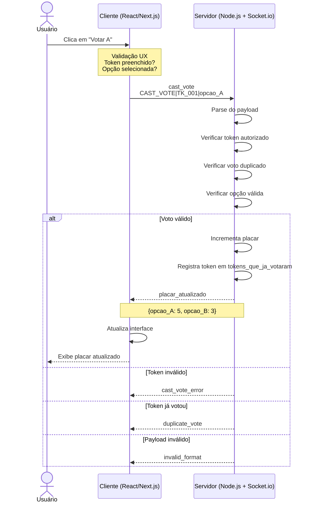

# CIN0143 - Digital Assembly Voting System

Sistema de votação digital distribuído para assembleias de condomínios ou corporativas, com suporte a múltiplos clientes simultâneos e sessões em tempo real.

##  Visão Geral

Este repositório contém a arquitetura, a documentação e o esqueleto base de um **Sistema de Votação Digital para Assembleias**, projetado para:

- Gerenciar sessões de votação em tempo real
- Suportar múltiplos clientes conectados concorrentemente
- Garantir integridade e unicidade dos votos por token

---

## Entrega 2 — Comunicação e Core

Esta fase implementa o servidor multicliente com **Socket.io**, validação completa do comando `CAST_VOTE`, logs operacionais estruturados e console interativo para testes via terminal.

### Checklist da Entrega 2

| Requisito | Status | Implementação |
|---|---|---|
| Servidor multicliente (Socket.io) | ✅ | `apps/server/src/server.ts` |
| Validação CAST_VOTE (token + duplicidade) | ✅ | `apps/server/src/domain/vote-validator.ts` |
| Rejeição com logs detalhados | ✅ | `apps/server/src/handlers/vote-handler.ts` |
| Console de autenticação/testes | ✅ | `apps/server/src/console.ts` |
| Logs em console e arquivo | ✅ | `apps/server/src/loggers/logger.ts` → `apps/server/logs/` |
| README com exemplos de teste | ✅ | Seção abaixo |

### Quick Start (Entrega 2)

**1. Instalar dependências**

```bash
git clone <repo>
cd cin0143-digital-assembly
npm install
```

**2. Iniciar o servidor (Terminal 1)**

```bash
npm run dev
# ou
npm start
```

Saída esperada:

```
[2026-06-18 19:06:32] [INFO] [SERVER] Servidor iniciado
  ├─ url: http://localhost:3001
  └─ websocket: ws://localhost:3001
[2026-06-18 19:06:32] [INFO] [SERVER] Sistema aguardando conexões...
  └─ sessao_padrao: assembleia-2026-01
```

**3. Abrir console de testes (Terminal 2)**

```bash
npm run console
```

Comandos disponíveis:

```
  AUTH <token>          - Validar se token é autorizado
  VOTE <token> <voto>   - Simular voto (opcao_A ou opcao_B)
  STATUS <token>        - Verificar status do token
  LIST_TOKENS           - Listar tokens válidos
  LIST_VOTES            - Listar votos registrados
  PLACAR                - Exibir placar atual
  CLEAR / HELP / EXIT
```

**Tokens de teste pré-carregados:**

- `token_001_eleitor_001`
- `token_002_eleitor_002`
- `token_003_eleitor_003`
- `TK_CONDOMINO_450`

---

### Exemplos de Testes via Terminal

#### Teste 1: Voto válido (primeira votação)

```bash
votacao> AUTH token_001_eleitor_001
✓ Token válido e autorizado
✓ Token nunca votou antes
Status: PRONTO PARA VOTAR

votacao> VOTE token_001_eleitor_001 opcao_A
✓ Voto registrado com sucesso!
  ├─ Token: token_001_eleitor_001
  ├─ Voto: opcao_A
  └─ Status: VOTAÇÃO CONCLUÍDA
```

#### Teste 2: Voto duplicado rejeitado

```bash
votacao> VOTE token_001_eleitor_001 opcao_B
✗ VOTO REJEITADO - Duplicidade detectada
  ├─ Token: token_001_eleitor_001
  ├─ Motivo: Token já exerceu direito de voto
  ├─ Voto anterior: opcao_A
  └─ Ação: Voto recusado, log registrado
```

Logs gerados no servidor:

```
[ERROR] [VOTE_VALIDATION] Voto REJEITADO - Duplicidade detectada
  ├─ token: token_001_eleitor_001
  ├─ voto_tentado: opcao_B
  ├─ voto_anterior: opcao_A
  └─ acao_tomada: Voto rejeitado, sessão mantida aberta
```

#### Teste 3: Token inválido

```bash
votacao> AUTH token_invalido_xyz
✗ Token não autorizado
  ├─ Status: NÃO ENCONTRADO NA LISTA
  └─ Ação: Acesso negado
```

#### Teste 4: Voto via WebSocket (cliente remoto)

Com o servidor rodando, em outro terminal:

```bash
# Voto válido
npm run vote:test

# Voto com token/opção customizados
VOTE_TOKEN=token_002_eleitor_002 VOTE_OPCAO=opcao_B npm run vote:test
```

#### Teste 5: Múltiplos clientes simultâneos

Abra 3 terminais e execute em paralelo:

```bash
VOTE_TOKEN=token_001_eleitor_001 VOTE_OPCAO=opcao_A npm run vote:test
VOTE_TOKEN=token_002_eleitor_002 VOTE_OPCAO=opcao_B npm run vote:test
VOTE_TOKEN=token_003_eleitor_003 VOTE_OPCAO=opcao_A npm run vote:test
```

---

### Interpretando os Logs

Os logs são gravados em **stdout** e em arquivos em `apps/server/logs/`:

| Arquivo | Conteúdo |
|---|---|
| `app.log` | Todas as operações |
| `erros.log` | Erros e alertas de segurança |
| `auditoria.log` | Tentativas de fraude e duplicidade |

Formato:

```
[TIMESTAMP] [NIVEL] [MODULO] Mensagem
  ├─ campo: valor
  └─ campo: valor
```

Níveis: `INFO`, `SUCCESS`, `WARNING`, `ERROR`, `ALERT`, `AUDITORIA`

---

##  Stack & Justificativa Arquitetural

### Visão Full Stack

| Camada | Tecnologia | Papel |
|---|---|---|
| **Frontend** | React + Next.js | UI de votação e painel de monitoramento em tempo real |
| **Backend** | Node.js + Express.js | API HTTP, gerenciamento de sessões e roteamento |
| **WebSocket** | Socket.io | Canal de comunicação bidirecional em tempo real |
| **Linguagem** | TypeScript | Tipagem estática em todo o monorepo (front + back) |
| **Testes Unitários** | Jest | Validação de regras de domínio e lógica de negócio |
| **Testes de Carga** | K6 | Stress e concorrência de conexões WebSocket |

### Estrutura Monorepo

O projeto é organizado como um **monorepo**, separando claramente as responsabilidades

* A estrutura está descrita detalhadamente no final do README
-> A escolha pelo monorepo permite compartilhar tipos TypeScript entre frontend e backend, garantindo consistência nos contratos de mensagem.
  
## Arquitetura Cliente-Servidor

### Visão Geral

O sistema segue uma arquitetura **Cliente Servidor**:
- **Cliente**: Interface e validação UX 
- **Servidor**: Validação real, autorização, estado

### Diagrama de Arquitetura


## Por que Socket.io para o Sistema de Votação?

## Comunicação Orientada a Eventos e Bidirecional em Tempo Real

WebSockets, por meio do Socket.io, permitem comunicação **full-duplex** e **não bloqueante** entre clientes e servidor.

Para um sistema de votação, isso é essencial porque:

- Múltiplos clientes precisam receber atualizações instantaneamente conforme os votos são registrados.
- Sem atualização em tempo real, o placar pode ficar desincronizado.
- Alternativas baseadas em consultas repetidas (como ficar checando o sistema a todo momento) introduzem latência e aumentam o risco de inconsistências, incluindo vulnerabilidades relacionadas a votos duplicados.

## Baixo Acoplamento por Meio de Troca de Mensagens

O paradigma orientado a mensagens mantém os clientes desacoplados entre si.

Benefícios para o sistema de votação:

- O servidor propaga atualizações sem precisar conhecer detalhes da infraestrutura de cada cliente.
- Participantes pode se conectar simultaneamente.
- O placar permanece sincronizado globalmente.
- Novas regras de validação podem ser adicionadas futuramente sem alterar a comunicação entre clientes.

## Controle Centralizado da Sessão de Votação

O Socket.io mantém uma sessão persistente entre cliente e servidor, permitindo controle centralizado das conexões.

Isso possibilita:

- Identificação precisa do token associado a cada cliente conectado.
- Validação segura e singular dos tokens.
- Rastreamento confiável de quais participantes já votaram.
- Manutenção do servidor como única fonte de verdade do sistema.
- Eliminação de comandos simultâneos (race conditions) relacionadas ao processamento dos votos.

---
 
## Por que WebSocket em vez de MQTT?

## MQTT é Assíncrono e Altamente Desacoplado
Embora essas características sejam vantajosas em diversos cenários de IoT e telemetria, elas representam desafios para sistemas de votação - tornam difícil garantir que um token não vota duas vezes em alta concorrência.

Problemas potenciais:
- Um cliente pode receber confirmação de publicação antes da conclusão efetiva do processamento do voto.
- Caso ocorra uma falha entre a confirmação do broker e a persistência da operação no servidor, o sistema pode entrar em estado inconsistente.
- Torna-se mais difícil garantir a regra de **um voto por token** 

Além disso, Socket.io oferece **broadcast nativo de baixíssima latência** para sincronizar o placar em tempo real para todos os clientes, enquanto MQTT exigiria roteamento através de um broker separado.

---
##  Protocolo de Comunicação e Especificação de Payloads
 
A comunicação entre o Cliente e o Servidor  (Express/Socket.io) é orientada a eventos (**Event Driven**) e estruturada sob os seguintes contratos de mensagem:
 
---
 
### 1. Evento: `cast_vote` - Client → Server
 
| Campo | Valor |
|---|---|
| **Descrição** | Disparado pelo cliente para submeter um voto na assembleia |
| **Tipo de Dado** | String de texto simples (Textual Pleno) |
| **Delimitador** | `\|` (Pipeline) |
| **Formato Estrito** | `CAST_VOTE\|<token>\|<opcao>` |
| **Exemplo de Payload** | `CAST_VOTE\|TK_CONDOMINO_450\|opcao_B` |
 
---
 
### 2. Evento: `placar_atualizado` - Server → Broadcast (todos os clientes)
 
| Campo | Valor |
|---|---|
| **Descrição** | Disparado pelo servidor imediatamente após o registro bem-sucedido de um voto válido |
| **Tipo de Dado** | Objeto JSON |
| **Canal** | `placar_atualizado_${sessao_id}` |
 
**Exemplo de Payload:**
 
```json
{
  "opcao_A": 4,
  "opcao_B": 2
}
```
``




##  Modelagem de Estado em Memória

O servidor mantém as sessões ativas em memória volátil com o seguinte esquema:

```json
{
  "sessao_id": "string",
  "placar_atual": {
    "opcao_A": "number",
    "opcao_B": "number"
  },
  "tokens_autorizados": ["string"],
  "tokens_que_ja_votaram": ["string"],
  "votos_realizados": [
    {
      "token": "string",
      "voto": "opcao_A | opcao_B",
      "timestamp": "string",
      "sessao_id": "string",
      "ip": "string",
      "socket_id": "string"
    }
  ]
}
```
## Como Inicializar uma Sessão

POST /api/sessions
Content-Type: application/json

```json
{
  "session_id": "ASSEMBLY_CONDOMINIO_JUN_2026",
  "opcoes": [
    "opcao_A",
    "opcao_B"
  ],
  "tokens_autorizados": [
    "TK_001",
    "TK_002",
    "TK_003"
  ]
}
```

Response: 201
{ "session_id": "...", "status": "OPEN" }

---

| Campo | Descrição |
|---|---|
| `sessao_id` | Identificador único da assembleia em curso |
| `placar_atual` | Contador em tempo real mapeando opções para totais de votos |
| `tokens_autorizados` | Lista de controle de acesso com tokens autorizados a votar |
| `tokens_que_ja_votaram` | Ledger antifraude com tokens que já submeteram um voto |

---

## Regras de Domínio & Lógica de Validação

Ao receber um payload no listener `cast_vote`, o backend executa um funil de verificação sequencial:

```
Payload recebido
      │
      ▼
┌─────────────────────────────────────────┐
│  Format Check                           │
│  Conforma com CAST_VOTE|<token>|<opcao>?│
└──────────────────┬──────────────────────┘
                   │ 
                   ▼
┌─────────────────────────────────────────┐
│  Step 1 - Autenticação                  │
│  <token> existe em tokens_autorizados?  │
└──────────────────┬──────────────────────┘
                   │ 
                   ▼
┌─────────────────────────────────────────┐
│  Step 2 - Controle de Duplicatas        │
│  <token> já está em                     │
│  tokens_que_ja_votaram?                 │
└──────────────────┬──────────────────────┘
                   │ (não votou ainda)
                   ▼
┌─────────────────────────────────────────┐
│  Step 3 -  Registro                     │
│  Incrementa placar_atual[opcao]         │
│  Adiciona token a tokens_que_ja_votaram │
└──────────────────┬──────────────────────┘
                   │
                   ▼
┌─────────────────────────────────────────┐
│  Step 4 - Broadcast                     │
│  e placar_atualizado_sessao             │
└─────────────────────────────────────────┘
```

> Qualquer falha em uma etapa retorna uma mensagem de erro ao cliente e **interrompe** o pipeline.

## Eventos de Erro (Server → Client)

| Evento | Payload | Quando |
|--------|---------|--------|
| cast_vote_error | {"error": "unauthorized"} | Token não autorizado |
| cast_vote_error | {"error": "duplicate_vote"} | Token já votou |
| cast_vote_error | {"error": "invalid_format"} | Payload malformado |

---
---

##  Testes & Verificação


### Ferramentas

| Ferramenta | Camada | Finalidade |
|---|---|---|
| **Jest** | Unitário / Integração | Testar validadores e regras de domínio isoladamente |
| **K6** | Carga & Concorrência | Simular clientes WebSocket simultâneos |

---

### Testes Unitários com Jest

Os testes unitários cobrem as regras de domínio do pipeline de validação de forma isolada.

**Executar:**

```bash
npm run test:coverage
```

**Cenários planejados:**

| Cenário | Descrição | Resultado Esperado |
|---|---|---|
| **A - Happy Path** | Token válido vota em opção válida | Placar incrementado, token registrado, broadcast emitido |
| **B - Fraude (double vote)** | Token válido submete `CAST_VOTE` duas vezes | Erro retornado (Passo 2) |
| **C - Intrusão** | Token não listado tenta votar |Erro retornado (Passo 1) |
| **D - Payload malformado** | String fora do formato `CAST_VOTE\|<token>\|<opcao>` | Rejeitado no Format Check |


###  Testes de Carga & Concorrência com K6

O K6 será utilizado para simular alta concorrência de clientes WebSocket e identificar gargalos no event loop do servidor.

**Executar:**

```bash
k6 run tests/load/voting-stress.js
```

**Metas do cenário de stress:**

| Parâmetro | Valor Alvo |
|---|---|
| Clientes WebSocket simultâneos | 100+ |
| Janela de disparo | Mesma janela de milissegundos |
| Duração do teste | 60s |
| Taxa de erros aceitável | < 1% |

**O que será monitorado:**

- Race conditions no acesso concorrente ao estado em memória
- Consistência do placar após múltiplos votos simultâneos
- Comportamento do servidor ao receber tokens duplicados em paralelo

---

##  Como Executar

### Pré-requisitos

- Node.js 18+
- npm

### Instalação

Clone o repositório e instale as dependências de todo o monorepo:

```bash
npm install
```

### Comandos principais

| Comando | Descrição |
|---|---|
| `npm run dev` | Inicia servidor Express + Socket.io (porta 3001) |
| `npm run client` | Cliente manual independente, gera token e permite votar via terminal |
| `npm run console` | Console interativo local de autenticação e votação, incluindo `SESSION` |
| `npm run vote:test` | Cliente WebSocket de teste (envia um CAST_VOTE) |
| `npm test` | Testes unitários Jest |
| `npm start` | Servidor compilado (requer `npm run build` antes) |

| Serviço | URL padrão |
|---|---|
| Backend (Express + Socket.io) | `http://localhost:3001` |
| Frontend (Next.js) | `http://localhost:3000` |

### Cliente manual independente

Para conectar um cliente novo em outro terminal, gerar um token próprio e votar manualmente, rode:

```bash
npm run client
```

O cliente abre uma sessão Socket.io com o servidor, solicita autorização do token e passa a aceitar comandos no próprio terminal:

```text
token        # mostra o token gerado para aquele cliente
vote A       # envia voto para opcao_A
vote B       # envia voto para opcao_B
session      # solicita ao servidor o snapshot da sessão
status       # mostra a sessão e o token atuais
exit         # encerra o cliente
```

Se quiser listar todos os dados da sessão no servidor, use o console do backend:

```bash
npm run console
```

Depois execute:

```text
SESSION
```

Esse comando mostra a sessão ativa, o placar, os tokens autorizados a votar, os tokens que já votaram e os canais/eventos usados pelo Socket.io.

Cada conexão, autorização de token e voto aceito/rejeitado fica registrada nos logs do servidor.

Para testar duplicidade, use o mesmo cliente e execute `vote A` duas vezes. A segunda tentativa deve ser rejeitada como voto duplicado.


##  Autenticação em Memória & Prevenção de Fraude 

### Estratégia de Autenticação por Token
 
Para o escopo atual da arquitetura, o sistema evita consultas externas de sessão. A identidade é verificada **evento a evento**:
 
- O identificador único do cliente (Token) é embutido diretamente na string do payload
- A cada clique no botão de votação, o cliente transmite o texto estrito: `CAST_VOTE|<token>|<opcao>`
- O servidor analisa e processa os dados em tempo real: ao receber o evento, abre o envelope, isola o <token> e executa imediatamente as regras de domínio.

---
 
### Registros em Memória
 
Para gerenciar o rastreamento sem infraestrutura de banco de dados, o backend Express/Socket.io mantém as seguintes estruturas em tempo de execução:
 
| Estrutura | Tipo | Inicialização | Papel |
|---|---|---|---|
| `tokens_autorizados` | `string[]` | Populado no servidor | Registro de controle de acesso - lista todos os tokens legalmente registrados na sessão (ex.: `['TK_USER1', 'TK_USER2', 'TK_USER3']`) |
| `tokens_que_ja_votaram` | `string[]` | Inicializado vazio `[]` | Registro antifraude — barreira contra votos duplos, atualizada a cada voto confirmado |
 
---
 
###  Lógica Backend

Esta seção detalha a implementação prática do pipeline de validação definido acima e na seção ### Regras de Domínio & Lógica de Validação.
Quando uma string de payload  chega pela interface de rede WebSocket, há as seguintes validações:
 
```text
Payload de Entrada: "CAST_VOTE|TK_USER1|opcao_A"
              │
              ▼
   ┌────────────────────────────────┐
   │     Parsing da String          │ ──► Separa o payload pelo delimitador '|'
   └────────────────────────────────┘
              │
              ▼
   ┌────────────────────────────────┐
   │  Verificação de Autorização    │ ──► Inclui o token do usuário em tokens_autorizados.
   └────────────────────────────────┘     False: Rejeita com evento "Acesso Negado"
              │ True
              ▼
   ┌────────────────────────────────┐
   │  Bloqueio de Voto Duplo        │ ──► Inclui o token do usuário em tokens_que_ja_votaram
   └────────────────────────────────┘     Se já estiver lá: Rejeita com evento "Fraude Detectada" de duplicação. Caso contrário, vai para o último passo.
              │ False
              ▼
   ┌────────────────────────────────┐
   │  Registro (escrita)            │ ──► 1. Incrementa placar_atual['opcao_A'] em +1
   └────────────────────────────────┘     2. Insere 'TK_USER1' em tokens_que_ja_votaram
              │
              ▼
   Broadcast disparado para todos os sockets (placar_atualizado)
```


### Testes

```bash
# Testes unitários (Jest)
npm run test

# Testes de carga (K6)
k6 run tests/load/voting-stress.js
```

---

##  Estrutura de Diretórios

```
├── apps/
│   ├── web/                        # Frontend — Next.js + React
│   │   └── src/app/                # App Router (pages e layouts)
│   │
│   └── server/                     # Backend — Node.js + Express + Socket.io
│       ├── logs/                   # Logs operacionais (app, erros, auditoria)
│       └── src/
│           ├── console.ts          # Console interativo de testes (Entrega 2)
│           ├── domain/             # Parsers, validadores e regras de negócio
│           ├── handlers/           # Tratamento de votos e logging
│           ├── loggers/            # Sistema de logs estruturados
│           ├── repository/         # Estado efêmero em memória (sessões ativas)
│           └── server.ts           # Entry point — Express + Socket.io
│
├── script.ts                       # Cliente WebSocket de teste rápido
├── tests/
│   └── load/
│       └── voting-stress.js        # Script de carga K6
│
├── package.json                    # Workspaces do monorepo
└── README.md
```

---
